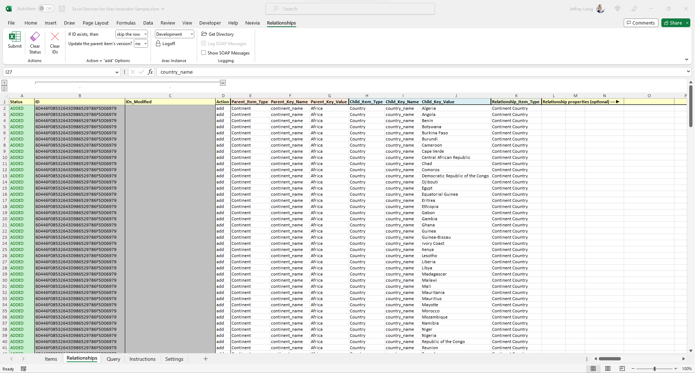
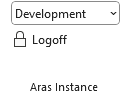

# Excel Services For Aras Innovator

A macro-enabled Excel workbook client for Aras Innovator

**NOTE:** _This spreadsheet was first written in 2011. Although it compiles on 32-bit and 64-bit versions of Microsoft Office 365, there is no guarantee that it still works. I no longer have access to any instances of Aras Innovator to test against, and I cannot provide support._

## Introduction	

The purpose of these worksheets is to generate syntactically-correct AML source than can be sent via Web Service calls to Aras. They will do no error checking on the data itself. Aras will do that. This spreadsheet is purely a **garbage in, garbage out** tool.

Two template worksheets are provided: one to load `Items` and one to load `Relationships`. A third worksheet facilitates querying the Innovator data. The `settings` worksheet is where you configure the URLs and database instance information for your installation.

## Item Data	

Used to add, update, and delete Items.

Each row will create the AML command to add, edit, or delete one Item.
	
Each row should have an action of either `add`, `edit`, `delete` in the Action column. Any other value will cause the row to be skipped.
	
To insert data specify an action of `add` in column E. 

Type any property values from column G onwards, using as many columns as you need. Type the names of the fields as the column headings in row 1. 

Only columns with data values in them will be used in generating AML source. This means you can mix and match different Item Types in the same list. Some columns will apply to one Item Type, and others to another ItemType, depending where you fill in values in the data rows. 

If you want the Aras-generated Sequence Number returned for the new Item, type the field name for appropriate attribute in column F (Sequence Attribute).

Press the `Submit` button. All rows of data will be converted to Web Service calls and sent to Aras for processing. As rows are added the Aras generated internal id string is returned and saved in the `ID` column.
	
If a row contains a value in the ID column you can perform actions of `edit` or `delete`. 
	
To edit a row, change the action value to `edit` and modify property values as appropriate. Press the Submit button and the item will be locked, modified, and unlocked assuming the item has not already been locked by somebody else. 
	
To delete a row, change the action value to `delete`. Press the Submit button and the item will be deleted. The ID strings of any items affected by the item deletion be returned (for example, relationships may have also been deleted) and the ID string will be cleared from the row.
	
## Relationship Data	

Used to add and create relationships.

Each row will create the AML command to add the data for one relationship.
	
Type the identification of the Parent item in columns E through G, and the name of the Relationship Type in column K. All of these fields are mandatory. The values must unique identify a single parent, otherwise applying the AML will raise an error.
	
It may be necessary to specify a compound search value to uniquely define a record (e.g. `field1='…' and field2='…'`). When entering the search value iin the list, **omit the leftmost and rightmost quotes, and escape all intervening quotes Java-style (\')**. 

For example, to construct a value:

`source_id='4EAEBDF025AF4271A3C736FD02B15264' and data_center='AWS'`

enter `source_id` as the Key Name, and set the Key value to:

`4EAEBDF025AF4271A3C736FD02B15264\' and data_center=\'AWS`
	
To create a relationship between a parent and a child Item, enter a unique identification of the Child item in columns H through J. To create a relationship that has no child Item, leave columns H through J blank. (Relationships with no child Item are used in n-tiered Item Type trees of relationship to relationship to relationship...)
	
Type any property values from column L onwards, using as many columns as you need. Type the names of the fields as the 	column headings in row 2. Only columns with data values in them will be used in generating AML source. This means you can mix and match different Relationship Types in the same list. Some columns will apply to one Relationship Type, and others to another Relationship Type, depending where you fill in values in the data rows.
	
To create a relationship to an existing child (`Pick Related` in the Aras GUI) set the action to `add`. The property values will be used as properties of that relationship.
	
To create a relationship and a new child in one operation (`Create Related` in the Aras GUI) set the action to `create`. The property values will be used as properties of the new child.
	
To generate AML source, Press the `Submit` button at the top left. The resulting AML input will be sent as a Web Service request to Aras for processing. Data is processed one row at a time, and the internal IDs of items created and affected by the relationships are saved to the spreadsheet.
	
## Query	

Used to query Items.

The drop-down menu labeled as `Name` will automatically populate with available Items based on the user's permissions.

After selecting an Item Type from the drop-down,  the column headers for the item's properties will appear.  Both the Property Label ("human-readable") and the Property Name (Aras fieldname) will display across the columns. 
	
Using the `Column Set` dropdown, a user can select the properties view they wish.  `Standard` provides the view a user would see in Aras.  `Hidden` provides the basic properties that all Item types have. e.g.. modified by, created on, etc.  `All`  returns both the properties from the `Standard` view and the `Hidden` view.
	
After selecting a view,  you may wish to remove properties and can do so by deleting the value within the label and name cells.  This will prevent the query from returning data for that property.
	
Using the `Filter` row beneath the Property name row,  you can limit the query results even further by using wildcard and SQL conditional symbols.  For example, `*`, `%`, `=`, `<>`, `<`, `>`, `>=`, `<=`

Multiple criteria can be entered for a property by separating each with a comma. e.g.. `>200,<=500`
	
Click on the `Submit Query` button to get the results.  To clear results, use the `Clear Results` button.
	
To make changes to the data you can copy it to the `Items` tab, make the changes, and submit it.

## Settings	

The `settings` worksheet is where you configure the URLs and database instance information for your installation. 

### Aras Instance List

For each Aras instance:
1. Assign a name (e.g. Development, Production)
2. Specify the URL to reach that instance
3. Specify the database on that instance

All the instance names will appear in the Aras Instance dropdown list. 

||
|----------------------------|

You then select which instance the spreadsheet should work with from the dropdown choices. 

### Logon

Before any Aras Innovator interaction can take place you must provide your userid and password for authentication.

### Logoff

To logoff, press the `Logoff` button in the `Aras Instance` group.

### Logging

Logging of the Web Service requests and responses can be enabled in the `Logging` group by specifying an logging directory to store the XML, and toggling the feature on.

||
|----------------------------|

## Excel Information

This spreadsheet was written in 2011 using early binding. Early binding is not very friendly for sharing workbooks. [You may have to update the references on your instance of Excel](https://www.superexcelvba.com/en/tutorial/030-libraries) to make the macros run. The references which need to be set are:

